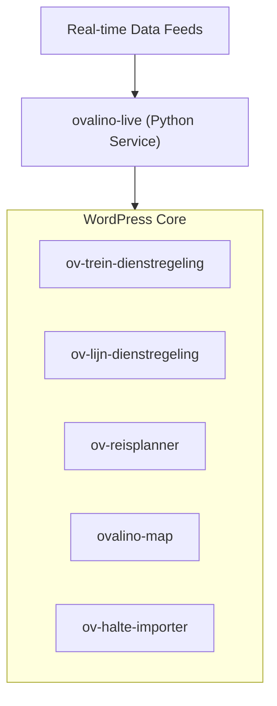

# Ovalino Plugin Suite

The **Ovalino Plugin Suite** is a modular collection of WordPress plugins and Python daemons designed to integrate real-time and scheduled public transit data (Dutch OV / GTFS-RT / NDOV - licensing at GOVI is required to use these datasets) into WordPress websites.

---

## Suite Components

### WordPress Plugins

1. **`ov-trein-dienstregeling`**
   * **Purpose:** Displays train departure boards and schedules.
   * **Type:** WordPress Plugin

2. **`ov-lijn-dienstregeling`**
   * **Purpose:** Manages and displays route schedules and timetables for bus, tram, and metro lines.
   * **Type:** WordPress Plugin

3. **`ov-reisplanner` (still work in progress)**
   * **Purpose:** Interactive journey planner component allowing users to calculate transit routes between locations or stops.
   * **Type:** WordPress Plugin

4. **`ovalino-map`**
   * **Purpose:** Interactive map interface for displaying stop locations, active routes, and real-time vehicle positions using custom JavaScript (`assets/map.js`) and CSS (`assets/map.css`).
   * **Type:** WordPress Plugin

5. **`ov-halte-importer`**
   * **Purpose:** Imports and synchronizes transit stop locations and metadata into the WordPress database. Includes a companion Python script (`ov-realtime-daemon.py`) for background processing.
   * **Type:** WordPress Plugin & Python Daemon

---

### Background Services & Daemons

6. **`ovalino-live`**
   * **Purpose:** Python-based daemon (`ovalino_live.py`) for streaming, parsing, and caching real-time transit updates. Includes a systemd service file (`ovalino-live.service`) for deployment on Linux environments.
   * **Configuration:** Managed via `config.yaml`.
   * **Dependencies:** Listed in `requirements.txt`.

---

## System Architecture


---

## Installation & Setup

### 1. WordPress Plugins
1. Copy the plugin directories (`ov-trein-dienstregeling`, `ov-lijn-dienstregeling`, `ov-reisplanner`, `ovalino-map`, `ov-halte-importer`) into your WordPress installation directory:
wp-content/plugins/

2. Activate the required plugins via the WordPress Admin dashboard or using WP-CLI:
```bash
wp plugin activate ov-trein-dienstregeling ov-lijn-dienstregeling ov-reisplanner ovalino-map ov-halte-importer
2. Python Live Daemon (ovalino-live)
Navigate to the ovalino-live folder:

Bash
cd ovalino-live
Install the required Python dependencies:

Bash
pip install -r requirements.txt
Update config.yaml with your environment credentials and data feed endpoints.

(Optional) Install as a systemd service on Linux:

Bash
sudo cp ovalino-live.service /etc/systemd/system/
sudo systemctl daemon-reload
sudo systemctl enable --now ovalino-live
Licensing & Commercial Use
This software is published under a custom Source-Available License.

Free Use: Inspection of the source code, security auditing, and local/private testing environments are permitted free of charge.

Production Use: A separate license is required for every active or live production installation.

For licensing inquiries and production grants, refer to LICENSE.md
 or contact:

Website: https://ovnieuwsuitgroningen.nl/ovalino

Email: redactie@ovnieuwsuitgroningen.nl
